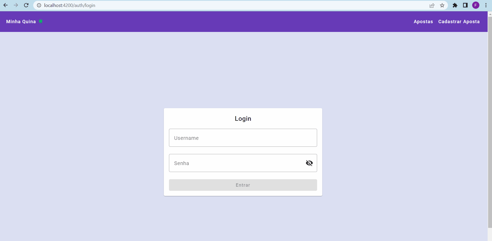

# Projeto Final - Framework Front-End II (Angular)
> *Turma 938 - Santander Coders - Trilha Web FullStack*

Desenvolvimento Front-end do projeto "Minha Quina" com o intuito de registrar apostas de Loteria, ver detalhes do sorteio e conferir o resultado (quantidade de acertos e prêmio);

## ✒️Autores 
- [Adriano Dias](https://github.com/asdiasx)
- [Ana Beatriz Trindade](https://github.com/anabeatrizdmt)
- [Felipe Zanardo](https://github.com/FelipeBZanardo)
- [Maria Helena](https://github.com/ma-helena)

## 📋Enunciado do Projeto

Como projeto final para o módulo de Framework Frontend II | Angular, espera-se que seja construída uma aplicação de gerenciamento (deixamos o escopo aberto para que a equipe escolha o tema do projeto, bem como as entidades).

OBS 1: Como sugestão, poderão criar o front-end, em cima de alguma API construída em módulos anteriores de back-end.

OBS 2: Uma outra alternativa é criar a aplicação de cadastro do currículo, desenvolvido no módulo anterior.

OBS 3: Ainda outra alternativa é utilizar alguma das APIs disponíveis  [neste link](https://free-apis.github.io/#/browse), conforme sugestão de um aluno, observando os requisitos listados abaixo.

Para qualquer que seja o caso, espera-se que o projeto implemente todos os tópicos abordados em aula. A saber:

-   Rotas e navegação
    
-   Services e Injeção de Dependências
    
-   Observables
    
-   Requisições HTTP
    
-   Autenticação e Proteção de Rotas
    
-   NgModules

## Demonstração
<p align="center">
  
</p>

## 📋  Pré-requisitos
- Ter instalado o **[Node.js®](https://nodejs.org/en)**;
- Ter instalado o Angular CLI:
`npm install -g @angular/cli`

## ⚙️ Executar o projeto:
Fazer o clone do repositório do projeto [Projeto-Final-Angular-II](https://github.com/FelipeBZanardo/Projeto-Final-Angular-II);

### 1 -  Back-end:
1) Selecionar o diretório "Back-end/minha-quina", abrir o projeto na sua IDE favorita (sugestão: **[IntelliJ](https://www.jetbrains.com/pt-br/idea/)**) e dar play na aplicação "MinhaQuinaApplication";

### 2 -  Front-end:

1) Abrir o projeto no Terminal e selecionar o diretório "Front-End":
`cd Front-End`
3) Instalar as dependências necessárias com o comando:
`npm install` 
4) Executar a aplicação em ambiente de desenvolvimento:
`ng serve` ou `npm start`
5) Abrir o navegador e acessar:
http://localhost:4200/

## 🧾 Bibliotecas utilizadas

- Biblioteca de Estilos CSS do **Bootstrap**:
`npm install bootstrap`
e inclusão do path de referência no arquivo **angular.json**:
``` 
"styles": ["node_modules/bootstrap/scss/bootstrap.scss"],
"scripts":
 ["node_modules/bootstrap/dist/js/bootstrap.bundle.min.js"]
```
- Biblioteca de Componentes **Angular Material**:
`ng add @angular/material`

- Biblioteca de Máscaras **Ngx-Mask**:
`npm i ngx-mask@13.1.13`
## 🛠️ Tecnologias Utilizadas

* [Visual Studio Code](https://code.visualstudio.com/) - IDE para Front-end
* [IntelliJ](https://www.jetbrains.com/pt-br/idea/) - IDE para Back-end
* [Angular](https://angular.io/) - Framework Web
* [Bootstrap](https://getbootstrap.com/) - Biblioteca CSS
* [Angular Material](https://material.angular.io/) - Biblioteca de Componentes


## 📈 Melhorias futuras

- Fazer o deploy da Aplicação;
- Melhorar o cadastro de usuários implementando mais informações pessoais;
- Implementar uma tela inicial de boas-vindas com informações básicas de funcionamento da aplicação.
